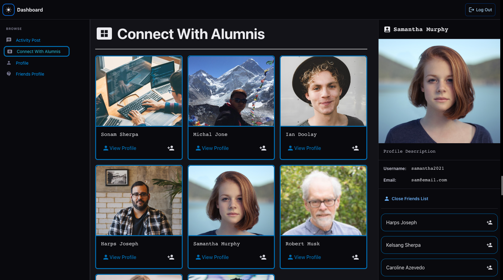
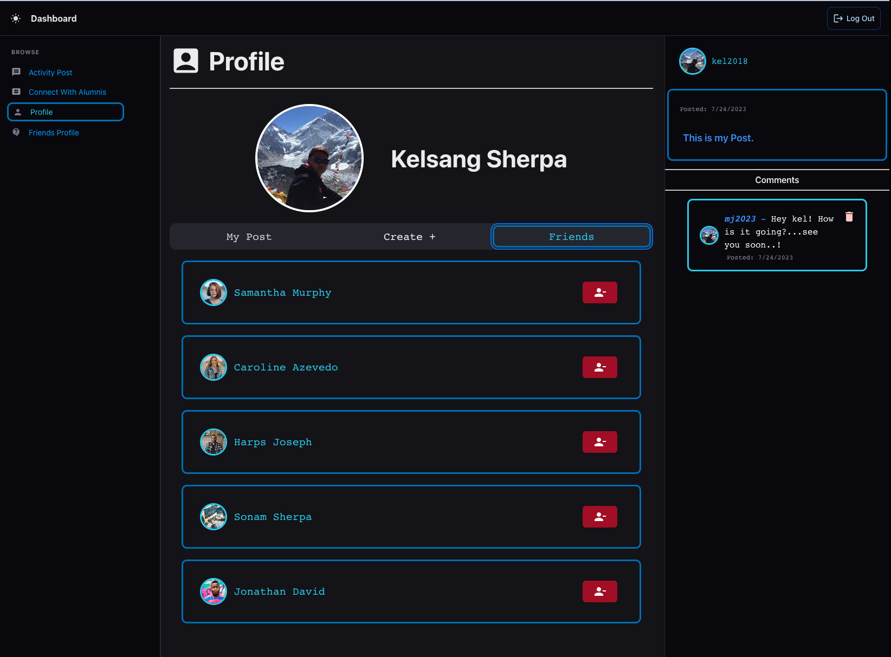

# MEARN_Alumni_Book Project 2023

[](https://opensource.org/licenses/MIT)

## Description.

The challenge for our team was to develop a comprehensive social media application that offers a user-friendly interface and extensive functionality. The application needed to enable users to create, edit, and manage their posts while also providing the ability to discover the friend and post, where they can share their post, and comment to the other user's post. Our application ensures a seamless user experience, offering secure, responsive, and accessible features across various devices and screen sizes.

Our objectives for this challenge were as follows:

- Authentication, allowing users to sign up, log in, and log out securely.
- Enable users to create, add, delete, and edit Posts
- Allow users to discover their friends, posts, other friends.
- Provide features for users to add comment to their friends post, and add the specific friend to their friendlist.
- Ensure that the application is responsive and accessible on various devices and screen sizes.

## Table of Contents:

- [Screenshots](#screenshots)
- [Gif](#gif)
- [User Story](#user-story)
- [Criteria](#criteria)
- [Installation Process](#Installation-Process)
- [Built With](#Built-With)
- [App Usage](#app-usage)
- [License](#License)
- [Questions](#questions)
- [Authors](#Authors)

## Screenshots:

### Figure 1. Home


### Figure 2. Sign up


### Figure 3. Login


### Figure 4. Activity / Posts


### Figure 5. Connect With Alumnis



### Figure 6. Create Post


### Figure 7. Friend List



### Figure 8. Light Mode


### Figure 9. Comment Post


## GIF:

#### The following animation demonstrates the application functionality:


## User Story:

```
As a user, I want a social media app where I can connect with my friends, upload my profile image,
add posts, view my friends' posts, like their posts, and comment on their posts. This will allow me
to stay connected with my friends and engage with their content.

```

## Criteria:

```
Given that I am a new user, I want to register myself by providing my first name, last name,
username, email, password, and profile image.
Given that I am a registered user, I want to log in to the app by providing my email and password.
Given that I am logged in, I want to be able to add a new post with a caption and an optional
image attachment.
Given that I am logged in, I want to be able to view the posts of my friends in my news feed.
Given that I am logged in, I want to be able to like a post from my friends.
Given that I am logged in, I want to be able to comment on a post from my friends.
Given that I am logged in, I want to be able to add a friend to my friend list by searching for
their username or email.
Given that I am logged in, I want to be able to remove a friend from my friend list.
Given that I am logged in, I want to be able to edit or delete a post that I have added.
Given that I am logged in, I want to be able to add a comment to a post.
Given that I am logged in, I want to be able to remove a comment that I have added.
Given that I am logged in, I want to be able to like a comment or post.
Given that I am logged in, I want to be able to update my profile image.
```

## Installation Process:

1. Clone the Repository from GitHub (or) Download Zip Folder from Repository from GitHub.
2. Open the cloned (or downloaded) repository in any source code editor.
3. Open the integrated terminal of the document and complete the respective installation guides provided in "Built With" to ensure the cloned documentation will operate.

## Built With:

- Dynamic JavaScript
- JSON: [JSON](https://www.npmjs.com/package/json)
- Mongoose: [7.0.3](https://www.npmjs.com/package/mongoose)
- Express: [4.18.2](https://www.npmjs.com/package/express)
- Node.js: [16.18.1](https://nodejs.org/en/blog/release/v16.18.1/)
- MongoDB: [Website](https://www.mongodb.com/)
- Nodemon: [2.0.12](https://www.npmjs.com/package/nodemon/v/2.0.12)
- Fontawesome: [6.4.0](https://www.npmjs.com/package/@fortawesome/)
- dotenv: [16.0.3](https://www.npmjs.com/package/dotenv)
- Express: [4.18.2](https://www.npmjs.com/package/express)
- GraphQL: [16.6.0](https://www.npmjs.com/package/graphql)
- JsonWebToken: [9.0.0](https://www.npmjs.com/package/jsonwebtoken)
- Mongodb: [5.1.0](https://www.npmjs.com/package/mongodb)
- Mongoose: [7.0.3](https://www.npmjs.com/package/mongoose)
- React: [18.2.0](https://www.npmjs.com/package/react)
- React-Dom: [18.2.0](https://www.npmjs.com/package/react-dom)
- React: [18.2.0](https://reactjs.org)
- GraphQL: [16.6.0](https://graphql.org)
- MongoDB: [5.1.0](https://www.mongodb.com)
- Mongoose ODM: [7.0.3](https://mongoosejs.com)
- JWT: [9.0.0](https://jwt.io)
- Heroku: [Website](https://www.heroku.com/platform)
- Cloudinary: [Website](https://cloudinary.com/)
- Material UI : [Website](https://mui.com/material-ui/)
- License Badge: [Shields.io](https://shields.io/)
- Visual Studio Code: [Website](https://code.visualstudio.com/)

### Continued Development:

1. Intellect, Discipline & Strength.
2. Improve the user interface and user experience with more advanced design and functionality.
3. Implement real-time notifications for user's post and friend addition.

## App Usage

1. Sign up or log in to access the JDT social media application securely.
2. Create, add, delete, and edit posts.
3. Browse other users post and comment on their post.
4. Add friend to your friend list.
5. Like friend's post.

## License

[]

### Copyright © 2023 [Team Alumni Book](https://github.com/sonam-git/MEARN_Alumni_Book).All Rights Reserved.

```md
Any individual who obtains a copy of the software and its associated documentation files
(referred to as the "Software") is granted permission, without any cost, to use, copy, modify,
merge, publish, distribute, sublicense, and/or sell the Software. There are no restrictions on
dealing with the Software, including the aforementioned rights. This permission is also extended
to those individuals to whom the Software is provided. However, it is essential that the copyright
notice and this permission notice are included in all copies or significant portions of the Software.

The Software is provided on an "as is" basis, without any warranty of any kind, whether expressed or implied.
This includes, but is not limited to, warranties of merchantability, fitness for a particular purpose, and
non-infringement. Under no circumstances shall the authors or copyright holders be held liable for any claim,
damages, or other liabilities arising from the use of the Software, regardless of whether it is an action of
contract, tort, or any other legal theory.

In summary, this permission grants the freedom to use, modify, distribute, and sell the Software without charge.
However, it is crucial to include the copyright notice and permission statement when distributing the Software.
It is also important to note that the Software is provided without warranties, and the authors or copyright holders
bear no responsibility for any claims or damages that may arise from its use.
```

## Questions

[Deployed Heroku Application](link)

[GitHub Repository](https://github.com/sonam-git/MEARN_Alumni_Book)

## Authors

- Sonam J Sherpa => (Backend/Frontend/UI) [Github](https://github.com/sonam-git)
- Evelyn Montes Sobal => (Backend/Frontend) [Github](https://github.com/EvelynMS1)
- JP Padilla => (Frontend/UI) [Github](https://github.com/jayP308)
- Jared Pelaez --------------- [Github](https://github.com/jaredpel)
- Dandar Ganbold ----------- [Github](https://github.com/Daganbold)
